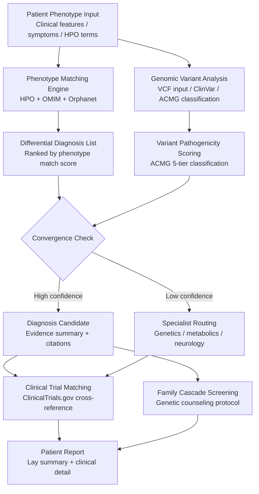

<p align="center">
  <h1 align="center">Foundation Rare Dx</h1>
  <h3 align="center"><em>Rare disease diagnosis accelerator.<br>300 million people. 5–7 years to a name for what's wrong.</em></h3>
</p>

<p align="center">
  <a href="LICENSE"></a>
  
  
  
  
  <a href="https://mama.oliwoods.ai"></a>
  <a href="https://mama.oliwoods.ai/foundation"></a>
</p>

---

> **300 million people worldwide live with a rare disease. The average patient sees 7.3 physicians across 4 specialties over 5–7 years before receiving a correct diagnosis — if they ever do.** During that odyssey, they receive an average of 2–3 misdiagnoses that lead to harmful treatments. 30% experience a mental health crisis from the uncertainty alone. Meanwhile, 80% of rare diseases have a known genetic cause, and the data to diagnose them often already exists in the patient's genome or medical record. **This library is the AI layer between a sick person and a name for what's wrong with them: phenotype matching across 7,000+ disease databases, genomic variant interpretation, specialist routing, and clinical trial matching.** The diagnostic odyssey is a data problem. We're solving it with data.

---

## Why This Exists

- **7,000+ rare diseases, one AI engine.** NORD (2023) identifies 7,000 known rare diseases affecting 300M people globally. Only 5% have an FDA-approved treatment. The first step to any treatment is a correct diagnosis — which this library accelerates from years to weeks.
- **Misdiagnosis is the norm, not the exception.** Studies show 40% of rare disease patients receive at least one misdiagnosis (Shire, 2013). Each misdiagnosis costs an average of $36,000 in unnecessary treatment and delays correct care by 14 months.
- **The data exists — it's just fragmented.** Genomic sequencing costs under $500. HPO phenotype databases cover 15,000+ clinical features. ClinVar, OMIM, Orphanet, and Monarch Initiative hold diagnosis-relevant data for nearly all known rare diseases. No single tool connects them all.
- **Rare is not rare in aggregate.** 300 million people means rare diseases are as prevalent as diabetes (422M). They receive 5% of the R&D investment. The math is a policy failure, not a science failure.

---

## How It Works



---

## Features & Modules

| Module | What It Does |
|--------|-------------|
| **phenotype-matcher** | Maps clinical features to HPO (Human Phenotype Ontology) terms. Scores against OMIM, Orphanet, and Monarch Initiative disease databases. Returns ranked differential diagnosis list with match confidence |
| **genomic-interpreter** | Interprets VCF files against ClinVar, HGMD, and gnomAD. ACMG/AMP 5-tier pathogenicity classification (Pathogenic/Likely Pathogenic/VUS/Likely Benign/Benign). Gene-disease relationship scoring |
| **differential-ranker** | Combines phenotype and genomic evidence into unified diagnostic probability scores. Bayesian framework incorporating prior disease prevalence, phenotype specificity, and variant penetrance |
| **specialist-router** | Maps diagnosis candidates to appropriate specialty (genetics, metabolics, neurology, immunology, etc.). Identifies centers of excellence for specific conditions. Insurance pre-authorization workflows |
| **trial-matcher** | Queries ClinicalTrials.gov in real-time. Matches diagnosis candidates and genomic findings to open enrollment trials. Filters by age, geography, and prior treatment history |
| **family-screening** | Cascade genetic screening protocols for autosomal dominant/recessive and X-linked conditions. Generates family pedigree risk assessments and counseling recommendations |
| **literature-miner** | PubMed case report mining for ultra-rare conditions. Extracts phenotype-genotype correlations from case series. Critical for diseases with fewer than 100 reported cases |
| **report-generator** | Dual-format diagnostic reports: clinical detail for geneticists, lay language summary for patients. Evidence citations, diagnostic confidence, and next-step recommendations |
| **biomarker-panel** | Suggests targeted lab panels based on phenotype cluster. Avoids shotgun testing — prioritizes highest-yield tests for the differential |
| **longitudinal-tracker** | Tracks phenotype evolution over time. Re-scores differentials as new features emerge or tests return. Flags diagnostic pivots |

---

## How It Works — Technical

This is a **TypeScript algorithm library** with external database integrations for rare disease knowledge bases.

```typescript
import {
  mapToHPOTerms,               // Clinical feature → HPO ontology
  matchPhenotypeToDisease,      // Ranked differential against OMIM/Orphanet
  interpretGenomicVariants,     // VCF → ACMG classification
  rankDifferentials,            // Bayesian phenotype + genomic fusion
  matchClinicalTrials,          // ClinicalTrials.gov real-time query
  generateDiagnosticReport,     // Dual-format patient + clinician output
} from "foundation-rare-dx";
```

**Data source integrations:**
- **OMIM** — Online Mendelian Inheritance in Man (gene-disease relationships)
- **Orphanet** — Rare disease and orphan drug database
- **HPO** — Human Phenotype Ontology (clinical feature standardization)
- **ClinVar** — NCBI variant pathogenicity database
- **gnomAD** — Population-level variant frequency data (Broad Institute)
- **Monarch Initiative** — Cross-species phenotype-genotype knowledge graph

---

## Research Backing

> Shire (2013). *Rare Disease Impact Report: Insights from Patients and the Medical Community.* — 40% of rare disease patients are misdiagnosed; average 7.3 physicians across 5-7 years before correct diagnosis.

> Chong, J. X., et al. (2015). "The Genetic Basis of Mendelian Phenotypes: Discoveries, Challenges, and Opportunities." *American Journal of Human Genetics, 97*(2). — 80% of rare diseases have a known or suspected genetic cause; exome/genome sequencing resolves ~30-40% of unsolved cases.

> Garber, K. (2019). "The new era of rare-disease diagnosis." *Nature, 569*, 458–459. — AI phenotype matching combined with genomic interpretation cuts diagnostic time from years to weeks in clinical pilots.

> Kohler, S., et al. (2021). "The Human Phenotype Ontology in 2021, an explosion of new data and new tools." *Nucleic Acids Research, 49*(D1). — HPO now covers 15,000+ clinical features and 8,000 diseases. The phenotype-matcher module is built on this ontology.

> Boycott, K. M., Vanstone, M. R., Bulman, D. E., & MacKenzie, A. E. (2013). "Rare-disease genetics in the era of next-generation sequencing: discovery to translation." *Nature Reviews Genetics, 14*, 681–691. — The case for combining phenotypic and genomic data that forms the theoretical basis of this library.

---

## Quick Start

```bash
git clone https://github.com/OliWoods-Org/foundation-rare-dx.git
cd foundation-rare-dx
npm install
npm run build
npm test
```

## Tech Stack

- **Runtime:** Node.js + TypeScript
- **Validation:** Zod schemas
- **Ontology data:** HPO, OMIM, Orphanet (open access APIs)
- **Genomics:** ClinVar + gnomAD API integrations; VCF parsing via local tools
- **AI:** Claude API for case report NLP and report generation
- **Trials:** ClinicalTrials.gov API (real-time)

---

## Related Projects

| Project | Description |
|---------|-------------|
| [mama-drug-discovery](https://github.com/OliWoods-Org/mama-drug-discovery) | When there's no treatment for the rare disease we just diagnosed |
| [mama-mental-health](https://github.com/OliWoods-Org/mama-mental-health) | Diagnostic odyssey takes a severe mental health toll — integrated crisis support |
| [foundation-rx-access](https://github.com/OliWoods-Org/foundation-rx-access) | Getting orphan drugs to patients who can't afford them |
| [mama-ai-clinic](https://github.com/OliWoods-Org/mama-ai-clinic) | Offline deployment for settings without genetic counseling infrastructure |

---

## Contributing

Rare disease is by definition underpowered. We need everyone:

- **Clinical geneticists** — Validate phenotype matching accuracy and specialist routing
- **Genetic counselors** — Review family cascade screening protocols
- **Bioinformaticians** — Improve variant interpretation models and VCF parsing
- **Patient advocates** — Lived experience feedback on report language and usability

See [CONTRIBUTING.md](CONTRIBUTING.md) for guidelines.

---

## License

AGPL-3.0. Free forever. An [OliWoods Foundation](https://github.com/OliWoods-Org) project.

> *"The diagnostic odyssey is not a rite of passage. It is a failure of the system. We can end it."*

---

<p align="center">
  <strong>Built by the <a href="https://oliwoods.ai">OliWoods Foundation</a></strong><br>
  <em>Free forever. Open source. Because five years without a diagnosis is five years too many.</em>
</p>
